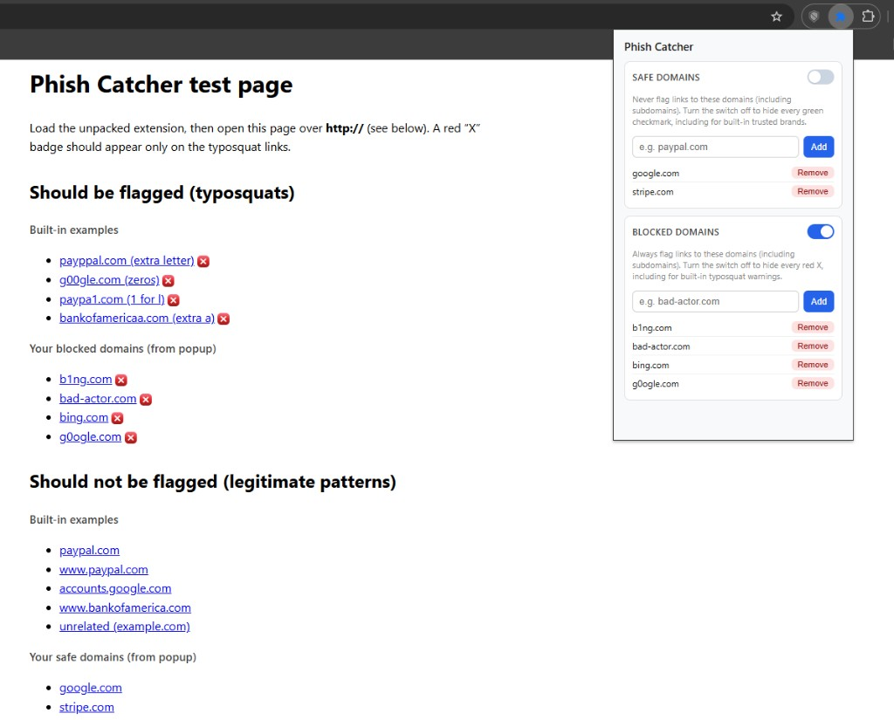
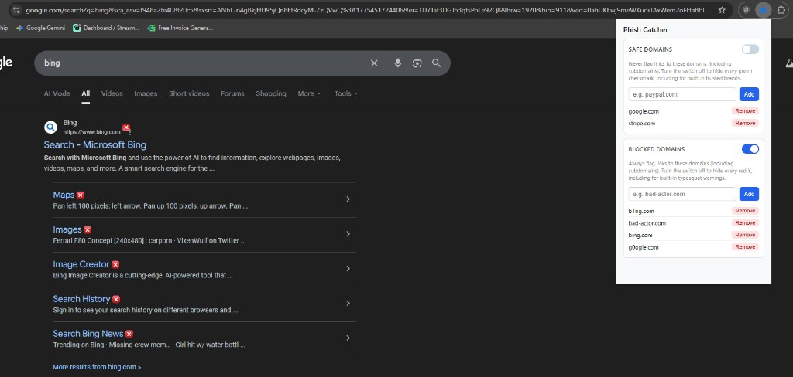

# Phish Catcher

Browser extension (Manifest V3) that highlights **suspicious links** while you browse: it compares link hostnames to a small set of well-known brand roots using **Levenshtein distance** (edit distance 1–2), and lets you maintain your own **safe** and **blocked** domain lists.

**Repository:** [github.com/MaverickHolloway3/PhishCatcher](https://github.com/MaverickHolloway3/PhishCatcher)

## Features

- **Typosquat detection** — Flags `http`/`https` links whose registrable-style root looks like a close misspelling of built-in targets: `paypal.com`, `google.com`, `bankofamerica.com`.
- **Safe domains** — Domains you add never get flagged; they show a **green check** badge next to the link (subdomains included).
- **Blocked domains** — Domains you add are always flagged with a **red X** badge (subdomains included).
- **Master toggles** — Turn off all safe indicators (including built-in trusted roots) or all flagged indicators (including typosquats) without deleting your lists.

## Install (Chrome / Chromium)

1. Clone or download this repository.
2. Open **Extensions**: `chrome://extensions` (or **⋮ → Extensions → Manage extensions**).
3. Enable **Developer mode**.
4. Click **Load unpacked** and select the extension folder (the one containing `manifest.json`).

## Try it

Open `test-page.html` in the browser (via a local or `http://` URL so the content script can run) to see example links and how they are marked.

## Screenshots

**Test page** — Typosquats and list-based links with badges; safe master toggle off (no green checks), blocked toggle on (red X on flagged links).

**Live site** — Example on Google results with `bing.com` on the blocked list: matching links show the red X badge next to the URL.

## How it works

1. The **content script** scans `a[href]` elements on each page.
2. Hostnames are normalized (scheme must be `http`/`https`; leading `www.` is stripped).
3. Evaluation order: **blocked list** → **safe list or exact built-in brand match** → **typosquat heuristic**.
4. Settings are stored in `chrome.storage.local` and updates apply on the next scan / storage change.

## Limitations

- This is a **lightweight heuristic**, not malware or phishing protection. Attackers can use unrelated domains, homographs, or other tricks this extension does not cover.
- Built-in brand roots and distance thresholds are **fixed in code**; adjust `TARGET_ROOT_DOMAINS` and logic in `content.js` if you fork the project.
- **IP addresses** and non-`http(s)` links are skipped.

## Permissions

- **`storage`** — Safe/blocked lists and toggle state.
- **`activeTab`** / **`scripting`** — Listed in `manifest.json`; link marking is performed by the content script on `<all_urls>`.

## License

Add a `LICENSE` file if you want to specify terms; otherwise clarify usage in your repository settings.
